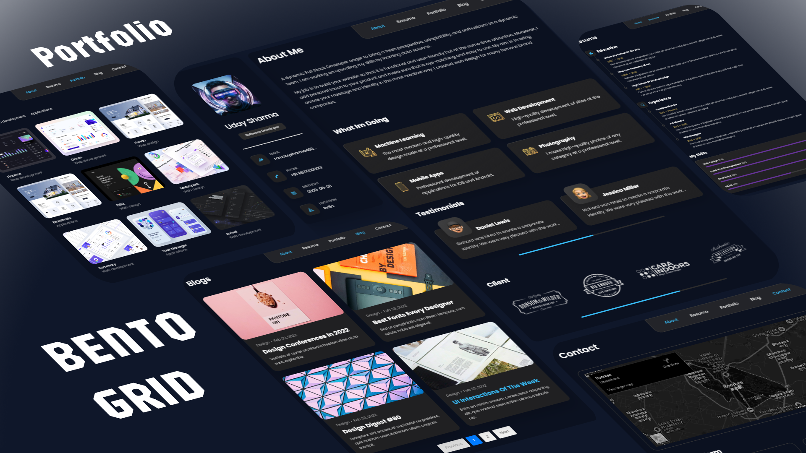

# BENTO GRID PORTFOLIO
***Bento Grid Portfolio*** is a personal portfolio application built using `React.js`, `Vite`, `CSS`, and the `Fetch API`. It showcases sections for About, Blogs, Contact, Portfolio, and Resume, with dynamic content fetching and a grid-based layout.

## Table of Contents

- [Demo](#demo)
- [Features](#features)
- [Installation](#installation)
- [Usage](#usage)
- [Technologies Used](#technologies-used)
- [Project Structure](#project-structure)
- [Contributing](#contributing)
- [License](#license)

## Demo


## Features

- ***Grid-Based Layout***: Modern, responsive portfolio design.
- ***Dynamic Data Fetching***: Blogs and portfolio data are fetched from JSON files using the Fetch API.
- ***Modular Structure***: Components for different sections such as About, Blog, Contact, Portfolio, and Resume.
- ***Interactive UI***: Responsive navigation and smooth transitions.

## Installation

To set up the project locally, follow these steps:

1. **Clone the repository:**

    ```bash
    git clone https://github.com/UdaySharmaGitHub/Reactjs-Projects.git
    cd Bento Grid-Portfolio
    ```

2. **Install dependencies:**

    ```bash
    npm install
    ```

3. **Start the development server:**

    ```bash
    npm run dev
    ```

    The app will be running at `http://localhost:5173`.

## Usage

- Navigate through different sections like **About**, **Blogs**, **Portfolio**, **Resume**, and **Contact**.
- Blogs and Portfolio items are fetched dynamically from JSON files located in the `public` folder using the Fetch API.
- Interact with the testimonials, services, and resume timeline to showcase your skills.

## Technologies Used

- ***React.js***: JavaScript library for building user interfaces.
- ***Vite***: Fast build tool for modern frontend development.
- ***CSS***: For styling and layout.
- ***Fetch API***: For fetching data from JSON files.
- ***JSON***: Storing data for blogs and portfolio items.

## Project Structure

```bash
├── public
│   ├── images
│   ├── data
│   │   ├── blogs.json
│   │   ├── portfolio.json
├── src
│   ├── components
│   │   ├── Asides.jsx
│   │   ├── Navbar.jsx
│   ├── pages
│   │   ├── about
│   │   │   ├── About.jsx
│   │   │   ├── Services.jsx
│   │   │   ├── Testimonial.jsx
│   │   ├── blogs
│   │   │   ├── Blogs.jsx
│   │   │   ├── BlogPost.jsx
│   │   │   ├── Blogs.css
│   │   ├── contact
│   │   │   ├── Contact.jsx
│   │   ├── portfolio
│   │   │   ├── Portfolio.jsx
│   │   ├── resume
│   │   │   ├── Resume.jsx
│   │   │   ├── Timeline.jsx
│   │   │   ├── SkillItem.jsx
│   ├── App.jsx
│   ├── main.jsx
│   ├── index.css
├── vite.config.js
├── package.json
└── README.md
```
## Folders & Components
- ***public/images:*** Contains images used in the application.
- ***public/json:*** Contains JSON files used for loading data dynamically via Fetch API.

## Components
- ***Asides.jsx:*** Side menu for easy navigation.
- ***Navbar.jsx:*** The main navigation bar for page navigation.

## Pages
### 1. About Folder
- ***About.jsx:*** Displays personal introduction and background.
- ***Services.jsx:*** Lists services you offer.
Testimonial.jsx: Displays client testimonials from a JSON file.
### 2. Blogs Folder
- ***Blogs.jsx:*** Displays a list of blog posts fetched from a JSON file.
- ***BlogPost.jsx:*** Displays a detailed view of an individual blog post.
Blogs.css: Contains styles for the blog pages.
### 3. Contact Folder
- ***Contact.jsx:*** Displays a contact form or information for reaching out.
### 4. Portfolio Folder
- ***Portfolio.jsx:*** Displays your work or project portfolio, dynamically loaded from a JSON file.
### 5. Resume Folder
- ***Resume.jsx:*** Displays your resume details.
- ***Timeline.jsx:*** Showcases your career timeline and milestones.
- ***SkillItem.jsx:*** Displays your skills in a visually appealing format.

## Technologies Used
- ***React.js:*** JavaScript library for building user interfaces.
- ***Vite:*** Modern frontend build tool for blazing-fast development.
- ***CSS:*** For custom styling of components and pages.
- ***Fetch API:*** To dynamically fetch data from local JSON files.

## How Fetch API Works in the App
- The app uses the Fetch API to load data for blogs, testimonials, and portfolio from JSON files located in the `public/json` folder. For example:
```bash
// Example of fetching data from a JSON file in Portfolio.jsx
useEffect(() => {
  fetch('/json/portfolio.json')
    .then((response) => response.json())
    .then((data) => setPortfolioItems(data))
    .catch((error) => console.error('Error fetching portfolio data:', error));
}, []);

```

## Contributing
- Contributions are welcome! If you have suggestions for improvements or find any issues, feel free to open an issue or submit a pull request.

## License
- This project is licensed under the MIT License. See the LICENSE file for more details.

This `README.md` explains the features, installation process, and project structure of the **Bento Grid Portfolio** application. It highlights how the Fetch API is used for dynamically loading content from JSON files and details each component's functionality. Adjust the "Demo" and repository links as needed for your project.
