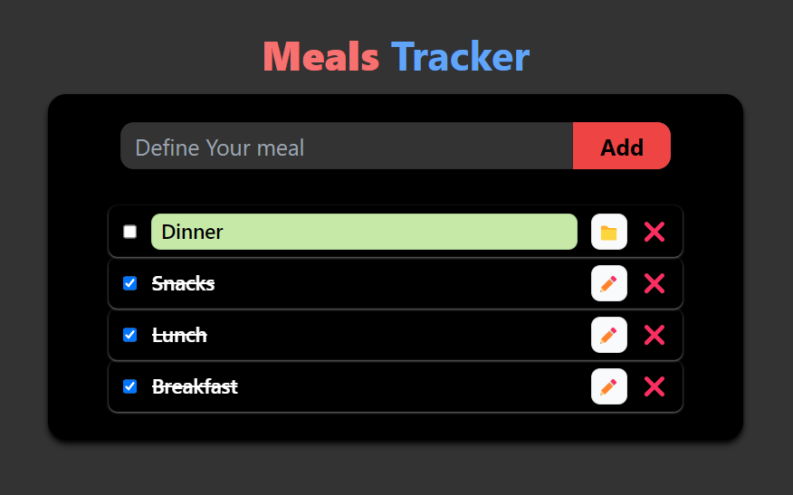

# Meal Tracker

A **Meal Tracker** application built with React, Vite, Tailwind CSS, and Context API. This app allows users to log meals and track their nutritional intake by managing the meal data globally with Context API.

## Table of Contents

- [Demo](#demo)
- [Features](#features)
- [Installation](#installation)
- [Usage](#usage)
- [Project Structure](#project-structure)
- [Technologies Used](#technologies-used)

## Demo



## Features

- Add meals with details like meal name, calories, and serving size.
- List of meals logged with dynamic rendering using React components.
- Global state management for meal data using Context API.
- Responsive UI built with Tailwind CSS.

## Installation

To set up the project locally, follow these steps:

1. **Clone the repository:**

    ```bash
    git clone https://github.com/UdaySharmaGitHub/Reactjs-Projects.git
    cd MealsTracker
    ```

2. **Install dependencies:**

    ```bash
    npm i
    ```

3. **Start the development server:**

    ```bash
    npm run dev
    ```

    The app will be running at `http://localhost:5173`.

## Usage

Once the app is running:

1. Use the **MealForm** component to log a meal by entering the meal name, calories, and serving size.
2. View the list of meals below the form using the **MealItem** component.
3. All meals are managed and displayed through global state using Context API.

## Project Structure

```plaintext
├── public
│   ├── index.html
├── src
│   ├── components
│   │   ├── MealForm.jsx
│   │   ├── MealItem.jsx
│   ├── context
│   │   ├── MealContext.js
│   │   └── index.js
│   ├── App.jsx
│   ├── main.jsx
│   ├── index.css
├── tailwind.config.js
├── vite.config.js
├── postcss.config.js
├── package.json
└── README.md
```
## Components
- ***MealForm.jsx:*** This component contains the form where users can input meal details like name, calories, and serving size. It updates the global meal state using the Context API.
- ***MealItem.jsx:*** This component displays individual meal entries from the global meal state.

## Context
- ***MealContext.js:*** This file defines the global context for managing meal data across the application.
- ***index.js:*** This file wraps the application with the MealProvider to provide access to the global meal state.

## Technologies Used
- ***React.js:*** JavaScript library for building user interfaces.
- ***Vite:*** A modern build tool providing a fast development experience.
- ***Tailwind CSS:*** Utility-first CSS framework for building responsive UIs.
- ***Context API:*** React's built-in feature for managing global state.