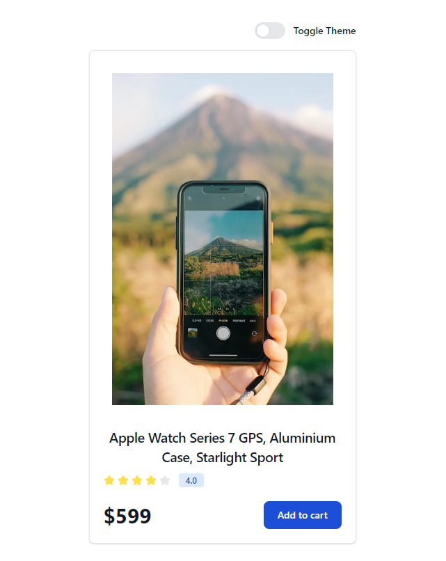

# Theme Switcher

A **Theme Switcher** application built using React, Vite, Tailwind CSS, and Context API. This project demonstrates how to toggle between light and dark themes across an entire application, leveraging global state management with Context API.

## Table of Contents

- [Demo](#demo)
- [Features](#features)
- [Installation](#installation)
- [Usage](#usage)
- [Project Structure](#project-structure)
- [Technologies Used](#technologies-used)

## Demo


## Features

- Toggle between light and dark themes with a button
- Persistent theme state across components using Context API
- Minimal and responsive design with Tailwind CSS
- Fast development experience with Vite

## Installation

To set up the project locally, follow these steps:

1. **Clone the repository:**

    ```bash
    git clone https://github.com/UdaySharmaGitHub/Reactjs-Projects.git
    cd ThemeSwitcher
    ```

2. **Install dependencies:**

    ```bash
    npm install
    ```

3. **Start the development server:**

    ```bash
    npm run dev
    ```

    The app will be running at `http://localhost:5173`.

## Usage

Once the app is running:

1. Use the theme switch button (implemented in **Themebtn.jsx**) to toggle between light and dark modes.
2. The theme will persist across different components like **Card.jsx**, styled according to the selected theme.
3. The application’s global theme state is managed using Context API and Tailwind classes are dynamically updated based on the theme.

## Project Structure

```plaintext
├── public
│   ├── index.html
├── src
│   ├── components
│   │   ├── Themebtn.jsx
│   │   ├── Card.jsx
│   ├── context
│   │   └── Theme.js
│   ├── App.jsx
│   ├── main.jsx
│   ├── index.css
├── tailwind.config.js
├── vite.config.js
├── postcss.config.js
├── package.json
└── README.md
```

## Components
- ***Themebtn.jsx:*** A button that allows users to toggle between light and dark themes. It updates the theme state and applies corresponding styles globally.
- ***Card.jsx:*** A simple card component styled according to the current theme using Tailwind CSS.

## Context
- ***Theme.js:*** The Context API file that manages the global theme state (light/dark) and provides a function to toggle between themes.

## Technologies Used
- ***React.js:*** A JavaScript library for building user interfaces.
- ***Vite:*** A fast build tool providing a modern development environment.
- ***Tailwind CSS:*** A utility-first CSS framework for styling.
- ***Context API:*** React's built-in feature for managing global state.
