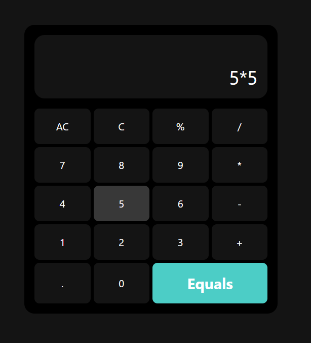

# Calculator App

A simple and responsive **Calculator** application built with React.js, Vite, and Tailwind CSS. The app features a clean UI and basic arithmetic functionalities.

## Table of Contents

- [Demo](#demo)
- [Features](#features)
- [Installation](#installation)
- [Usage](#usage)
- [Project Structure](#project-structure)
- [Technologies Used](#technologies-used)

## Demo


## Features

- Basic arithmetic operations (addition, subtraction, multiplication, division)
- Clean and responsive UI built with Tailwind CSS
- Clear button to reset the calculation
- Supports multi-digit calculations

## Installation

To set up the project locally, follow these steps:

1. **Clone the repository:**

    ```bash
    git clone https://github.com/UdaySharmaGitHub/Reactjs-Projects.git
    cd calculator
    ```

2. **Install dependencies:**

    ```bash
    npm i
    ```

3. **Start the development server:**

    ```bash
    npm run dev
    ```

    The app will be running at `http://localhost:5173`.

## Usage

Once the app is running:

1. Use the calculator interface to perform basic arithmetic operations.
2. Click the number keys to input values and the operator keys to perform calculations.
3. Press the **C** button to clear the input and reset the calculator.

## Project Structure

```plaintext
├── public
│   ├── index.html
├── src
│   ├── components
│   │   ├── Calculator.jsx
│   │   ├── Keys.jsx
│   ├── App.jsx
│   ├── main.jsx
│   ├── index.css
├── tailwind.config.js
├── vite.config.js
├── postcss.config.js
├── package.json
└── README.md
```

## Components
- ***Calculator.jsx:*** The main calculator component that manages the state of the application (display, current operation, result, etc.) and renders the UI.
- ***Keys.jsx:*** This component renders the calculator keys (numbers and operators) and passes the clicked key value back to the parent Calculator component.

## Tailwind CSS Setup
- Tailwind CSS is used for styling the calculator, providing a modern and responsive layout. Custom utility classes are used for creating a clean, minimalistic interface.

`Example Tailwind Configuration`
```javascript
module.exports = {
  content: ['./src/**/*.{js,jsx,ts,tsx}', './public/index.html'],
  theme: {
    extend: {},
  },
  plugins: [],
};
```

## Technologies Used
- ***React.js:*** JavaScript library for building user interfaces.
- ***Vite:*** Fast build tool for a modern development experience.
- ***Tailwind CSS:*** Utility-first CSS framework for rapid UI development.