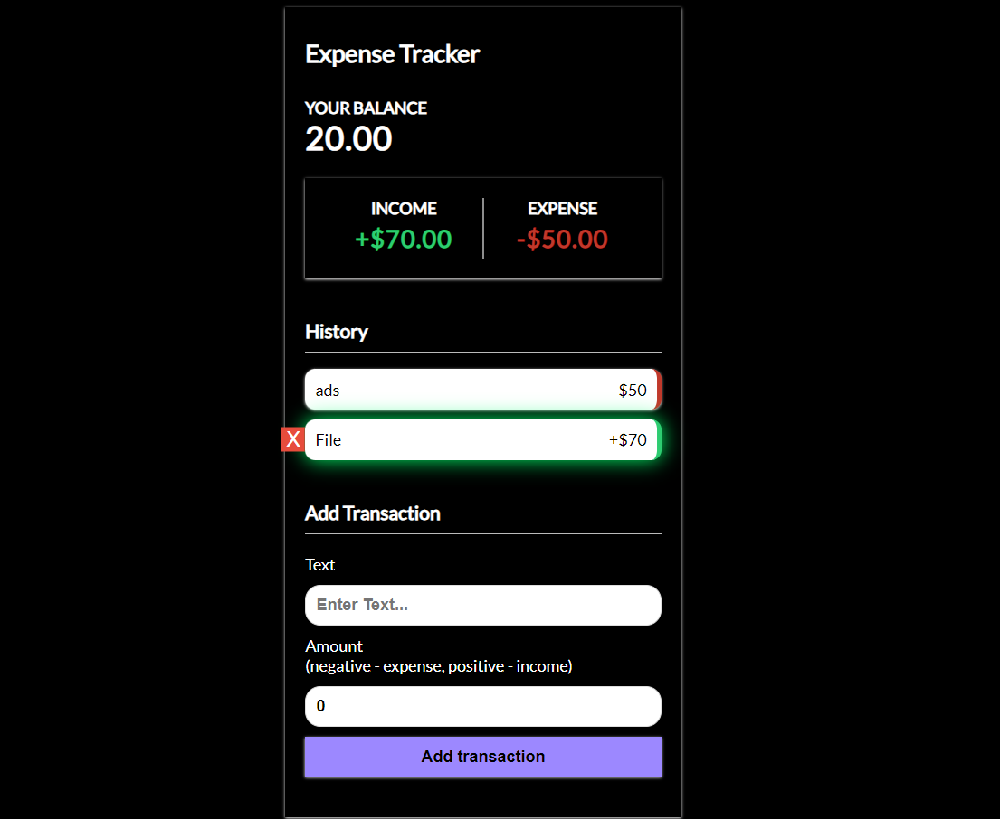

# Expense Tracker
A simple Expense Tracker application built using React.js with Vite and Context API for state management. This application helps you to track your income and expenses.



## Table of Contents
- [Features](#features)
- [Installation](#installation)
- [Usage](#usage)
- [Technologies Used](#technologies-used)
- [Project Structure](#project-structure)
- [Contributing](#contributing)
- [License](#license)

## Features
- Track income and expenses
- Display current balance
- View transaction history
- Add and delete transactions
- Persistent state using Context API

## Installation
To get started with the project, follow these steps:

1. **Clone the repository:**

    ```bash
    git clone https://github.com/UdaySharmaGitHub/expense-tracker.git
    cd expense-tracker
    ```

2. **Install dependencies:**

    ```bash
    npm install
    ```

3. **Start the development server:**

    ```bash
    npm run dev
    ```

    The application will be running on `http://localhost:5173`.

## Usage
1. Enter the details of your income or expense in the input fields provided.
2. Click "Add Transaction" to record the transaction.
3. The balance and transaction history will update accordingly.
4. You can delete any transaction from the history list.

## Technologies Used
- **React.js**: A JavaScript library for building user interfaces.
- **Vite**: A fast frontend build tool that provides a modern development environment.
- **Context API**: A React feature for managing state globally across the application.

## Project Structure
### Components
- **Header.jsx**: Displays the title of the application.
- **Balance.jsx**: Shows the current balance.
- **IncomeExpense.jsx**: Displays total income and total expenses.
- **TransactionList.jsx**: Lists all the transactions.
- **Transaction.jsx**: Represents a single transaction item in the list.
- **AddTransaction.jsx**: Form to add new income or expense transactions.
### Context Files
- **AppReducer.js**: Contains the reducer function to handle state changes based on action types.
- **GlobalProvider.jsx**: Wraps the application and provides the global state and dispatch functions to the components.
- **GlobalState.js**: Defines the initial state and the context, and provides helper functions for accessing and updating the state.

```plaintext
├── public
│   ├── index.html
├── src
│   ├── components
│   │   ├── AddTransaction.jsx
│   │   ├── Balance.jsx
│   │   ├── Header.jsx
│   │   ├── IncomeExpense.jsx
│   │   ├── TransactionList.jsx
│   │   ├── Transaction.jsx
│   ├── context
│   │   ├── AppReducer.js
│   │   ├── GlobalProvider.jsx
│   │   ├── GlobalState.js
│   ├── App.jsx
│   ├── main.jsx
│   ├── index.css
├── vite.config.js
├── tailwind.config.js
├── postcss.config.js
├── package.json
└── README.md
```