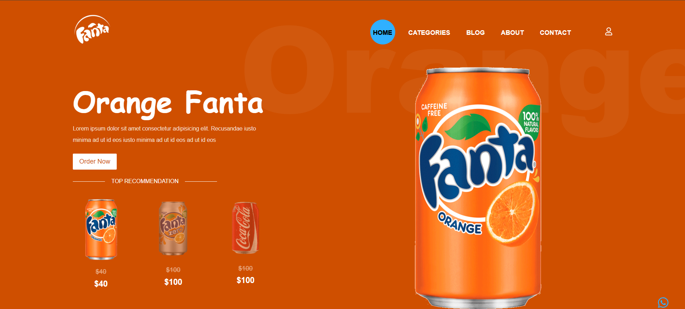

# Sodify

**Sodify** is a visually engaging web application built with Vite, React.js, and styled with Tailwind CSS. The app includes animated interactions using Framer Motion and a custom mouse follower effect powered by `react-mouse-follower`.

## Table of Contents

- [Demo](#demo)
- [Features](#features)
- [Installation](#installation)
- [Usage](#usage)
- [Technologies Used](#technologies-used)
- [Project Structure](#project-structure)
- [Contributing](#contributing)
- [License](#license)

## Demo


## Features

- Smooth animations with `Framer Motion`
- Custom mouse cursor interactions with `react-mouse-follower`
- Fully responsive design with `Tailwind CSS`
- Modern and interactive `Hero` and `Navbar` components

## Installation

To set up the project locally, follow these steps:

1. **Clone the repository:**

    ```bash
    git clone https://github.com/UdaySharmaGitHub/Reactjs-Projects.git
    cd sodify
    ```

2. **Install dependencies:**

    ```bash
    npm i
    ```

3. **Start the development server:**

    ```bash
    npm run dev
    ```

    The app will be running at `http://localhost:5173`.

## Usage

Once the app is running:

1. Experience a dynamic mouse follower interaction as you hover across the page.
2. The Hero section provides a sleek introduction to the app, with animations triggered by user scroll and hover.
3. The Navbar offers smooth navigation and interacts fluidly with the rest of the app.

## Technologies Used

- **React.js**: A JavaScript library for building user interfaces.
- **Vite**: A fast build tool providing a modern development environment.
- **Tailwind CSS**: A utility-first CSS framework for rapid UI styling.
- **Framer Motion**: A library for smooth animations and interactive UI transitions.
- **react-mouse-follower**: Adds a custom animated mouse follower that enhances user interactions.

## Project Structure

```bash
├── public
│   ├── index.html
├── src
│   ├── components
│   │   ├── Navbar.jsx
│   │   ├── Hero.jsx
│   ├── App.jsx
│   ├── main.jsx
│   ├── index.css
├── tailwind.config.js
├── vite.config.js
├── postcss.config.js
├── package.json
└── README.md
```

## Components
- ***Navbar.jsx:*** Implements a responsive navigation bar with smooth animations.
- ***Hero.jsx:*** Displays the hero section with Framer Motion animations and integrated mouse follower interactions.

## Animations and Interactivity
- ***Framer Motion:*** The animations in the app (scroll effects, hover states, etc.) are handled using Framer Motion, making the UI fluid and engaging.
- ***react-mouse-follower:*** This package enables a custom mouse follower, which dynamically interacts with the user's cursor, enhancing the app's overall interactivity.

## Contributing
Contributions are welcome! If you have suggestions for improvements or new features, please open an issue or submit a pull request.

## License
This project is licensed under the MIT License - see the LICENSE file for details.

This `README.md` file explains the features, setup, technologies used, and project structure for your **Sodify** application. It highlights the use of Framer Motion for animations and `react-mouse-follower` for interactive mouse effects. Adjust the "Demo" link and repository link as per your project details.
